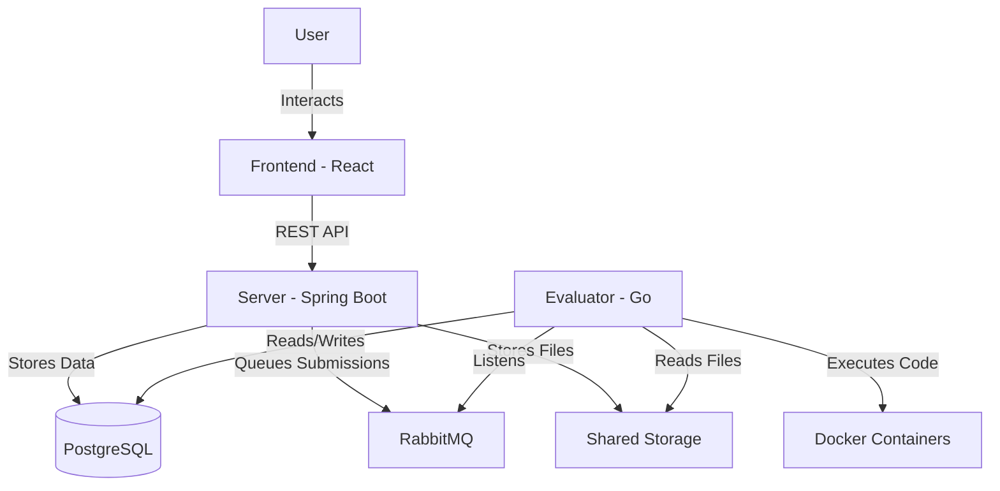

# Programming Judge

An application to post, solve and judge programming problems.

## Architecture

## Components

### [Server](Server/README.md)
A Spring Boot web server that provides REST APIs for user management, problem creation, and submission handling. It integrates with PostgreSQL for data persistence and RabbitMQ for asynchronous task processing.

### [Evaluator](Evaluator/README.md)
A Go-based service that consumes submissions from RabbitMQ, executes them within isolated Docker containers, and evaluates them against test cases.

### [Frontend](frontend/README.md)
A React-based web application that allows users to browse problems, submit solutions using a code editor (Monaco), and view real-time results.

### [Storage](Storage/README.md)
A shared file system storage that holds problem test cases (inputs and outputs) and user submission source code. It is accessed by both the Server (for writing submissions) and the Evaluator (for reading test cases and code).

## Demo

## Why I built this project

This project is a remake of my IEEE project at NITK [link here](https://github.com/Programming-Judge).
I felt that I did not contribute much in that project apart from a few things in the frontend.  
This project is a great way to understand concepts across domains like:
1. REST APIs
2. Containerization with Docker
3. Job Queues like RabbitMQ
4. Frontend development

Furthermore, the original project did not use a job queue and I wanted to have a peek into how using them would look like.

I have used Github copilot to code most of this project, but I learnt many concepts along the way.

